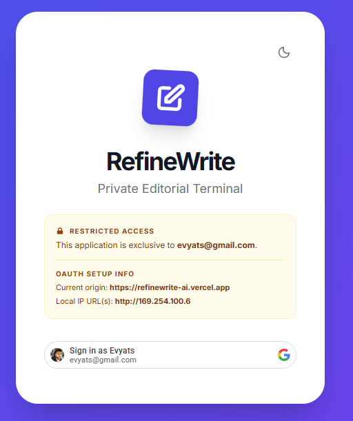
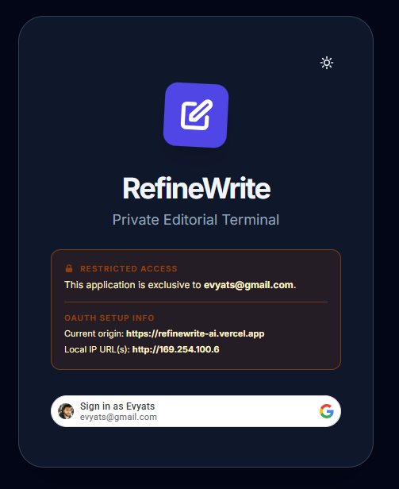
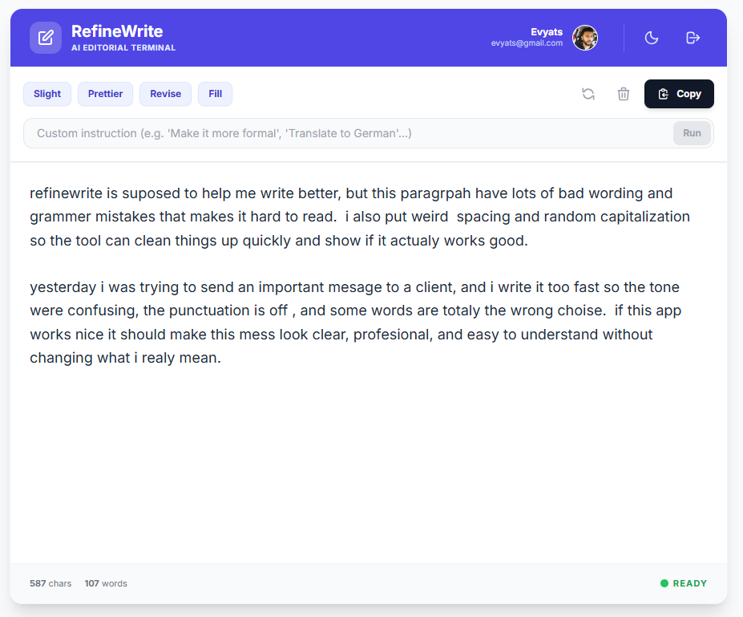
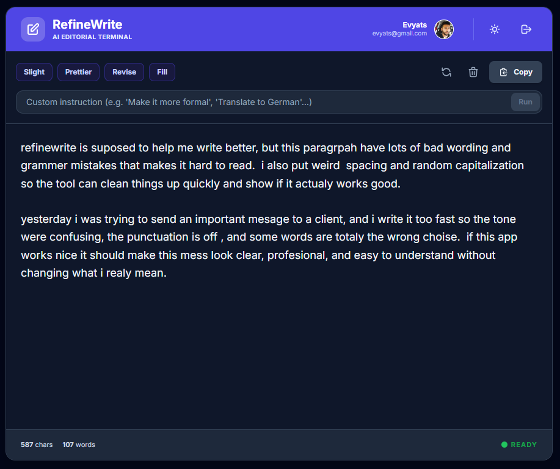
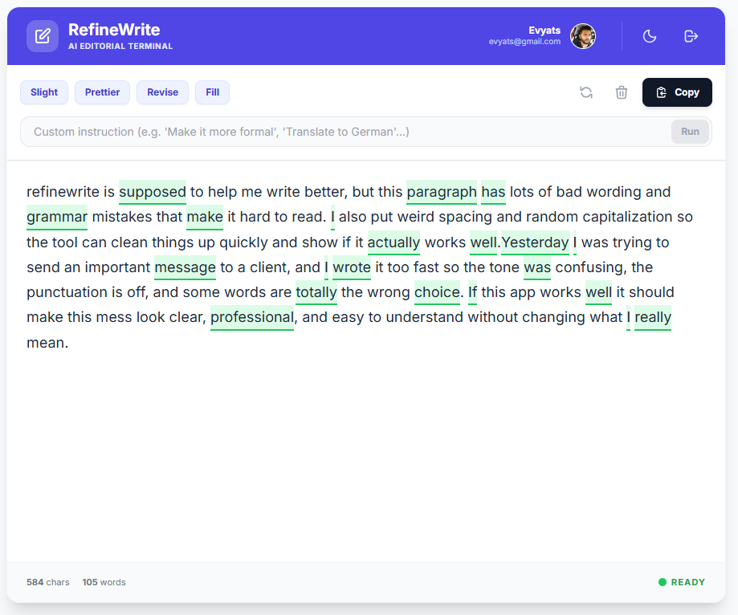
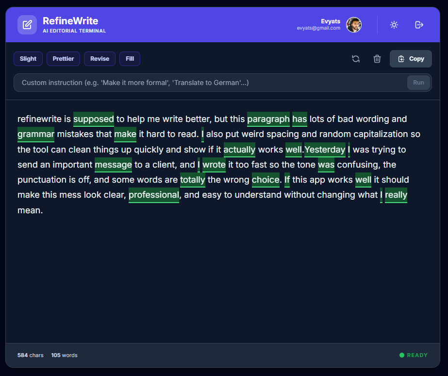

<h1>
  
  <span>RefineWrite AI</span>
</h1>

Production URL: https://refinewrite-ai.vercel.app/

RefineWrite is a React + Express editing app with:
- Google OAuth sign-in (single allowed email)
- Deterministic local `Prettier` mode
- Server-side OpenAI refinement for other modes via SSE streaming
- Inline changed-word highlighting and edit-back behavior

## Screenshots

<table>
  <tr>
    <td></td>
    <td></td>
  </tr>
  <tr>
    <td></td>
    <td></td>
  </tr>
  <tr>
    <td></td>
    <td></td>
  </tr>
</table>

## Tech stack

- Frontend: React + Vite + TypeScript + Tailwind classes + Framer Motion
- Backend: Express (`server.js` + `server/*`)
- Testing: Vitest

## Local development

Prerequisite: Node.js 18+

1. Install dependencies:
`npm install`

2. Create `.env.local`:
```env
OPENAI_API_KEY=YOUR_OPENAI_API_KEY_HERE
OPENAI_MODEL=gpt-4o-mini
GOOGLE_CLIENT_ID=YOUR_GOOGLE_CLIENT_ID_HERE
ALLOWED_EMAIL=your-email@example.com

# Optional safeguard controls
LLM_REFINEMENT_ENABLED=true
MAX_INPUT_CHARS=20000
MAX_REQUESTS_PER_MINUTE_PER_IP=20
MAX_REQUESTS_PER_DAY_PER_IP=300
MIN_INTERVAL_BETWEEN_REQUESTS_MS=500
MAX_CONCURRENT_REFINES_PER_IP=2
MAX_CONCURRENT_REFINES_GLOBAL=40
```

3. Run frontend + backend:
`npm run dev`

4. Open:
`http://localhost:43123`

## Commands

- Dev: `npm run dev`
- Build: `npm run build`
- Preview build: `npm run preview`
- API server only: `npm run dev:api`
- Frontend only: `npm run dev:web`
- Tests: `npm test`

## Security notes

- `OPENAI_API_KEY` is server-only and is never exposed to the client bundle.
- The browser calls `/api/refine`; only the server talks to OpenAI.
- OAuth access is restricted to `ALLOWED_EMAIL`.

## Deploy (Vercel or similar)

Set these env vars in the deployment project:
- `OPENAI_API_KEY`
- `OPENAI_MODEL` (optional)
- `GOOGLE_CLIENT_ID`
- `ALLOWED_EMAIL`

Vercel notes:
- API routes are served by `api/[...all].js` and include:
  - `POST /api/refine`
  - `GET /api/openai-status`
  - `GET /api/network-info`
- Serverless deployment mounts these handlers at function root so the external URLs remain `/api/*`.
